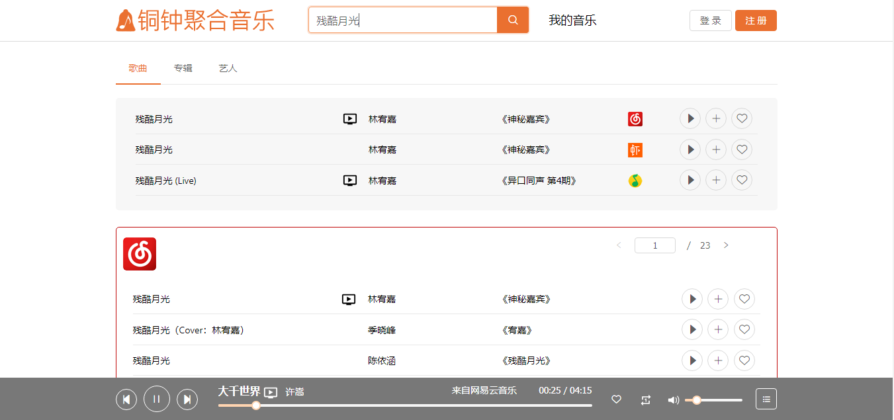

# 铜钟聚合音乐

- 在一处聆听所有音乐

It's online: <a href="http://tongzhong.xyz">http://tongzhong.xyz</a> 

## Screenshot

## Usage
    # Install dependencies
    npm install
    # Build client-side bundle
    npm run build
    # Start the server
    npm run server
Open `http://localhost:8080` to visit the page that uses the production build.

## Client-side development
    # Start webpack dev server
    npm start

## API from others
<ul>
<li><a href="https://github.com/Binaryify/NeteaseCloudMusicApi">Binaryify/NeteaseCloudMusicApi</a></li>
<li><a href="https://github.com/LIU9293/musicafe">LIU9293/musicafe</a></li>
</ul>
I really appreciate these projects!

## License
MIT
