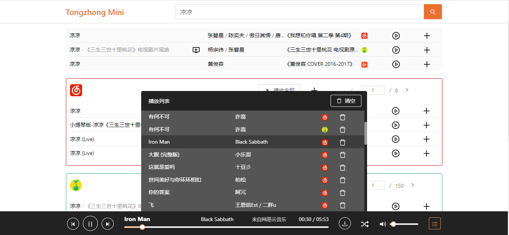
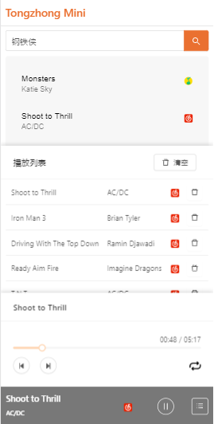

# tongzhong-music

<h3>Listen to the music from different platforms in one place.</h3>

## Features
### Desktop
- Search
 (Searching with query string is supported, try: <a href="http://mini.tongzhong.xyz/search?keyword=Iron%20Man&type=song" >http://mini.tongzhong.xyz/search?keyword=Iron%20Man&type=song</a>.)
- Play
- Download
- Hot list (including QQ Music and Netease Music)
- Record search history

### Mobile
- Search
- Play

## Usage
    # Install dependencies
    npm install
    # Build client-side bundle
    npm run build
    # Start the server
    npm run server
Open `http://localhost:8081` to visit the page that uses the production build.

## Developing
### Server-side
    # Start nodemon dev server (nodemon needs to be installed globally.)
    npm run dev-server

### Client-side
    # Start webpack dev server
    npm start
Open `http://localhost:3000/` for desktop, and `http://localhost:3000/m/` for mobile.

## Thanks
<ul>
<li><a href="https://github.com/Binaryify/NeteaseCloudMusicApi">Binaryify/NeteaseCloudMusicApi</a></li>
<li><a href="https://github.com/LIU9293/musicAPI">LIU9293/musicAPI</a></li>
</ul>

## License
MIT
